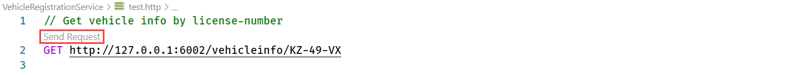

# Assignment 1 - Run the application

In this assignment, you'll run the application to make sure everything works correctly.

## Assignment goals

To complete this assignment, you must reach the following goals:

- All services are running.
- The logging indicates that all services are working correctly.

As a reminder, this is how the services will interact with each other:


## Step 1. Run the VehicleRegistration service

1. Open the source code folder in VS Code. This guide assumes VS Code, but feel free to use an editor or IDE you're comfortable with.

   > Throughout the assignment you can execute all steps in the same instance of editor or IDE window.

1. Open a terminal window.

   > You can do this by using the hotkey ``Ctrl-` `` (Windows) or ``Shift-Ctrl-` `` (macOS).

1. Make sure the current folder is `vehicle-registration-service`.

1. Start the service with command `go run ./cmd/main.go`

Now you can test whether you can call the VehicleRegistrationService. You can do this using a browser, cURL or some
other HTTP client. But there is a convenient way of testing RESTful APIs directly from VS Code (this uses the REST
Client extension VS Code):

1. Open the file `vehicle-registration-service/test.http` in your editor. The request in this file simulates retrieving the vehicle- and owner information for a certain license-number.

2. Click on `Send request` in the file to send a request to the API:

   

3. The response of the request will be shown in a separate window on the right. It should be a response with HTTP
   status code `200 OK` and the body should contain some random vehicle and owner-information:

   ```json
   HTTP/1.1 200 
   Connection: keep-alive
   Content-Type: application/json
   Date: Wed, 16 Jun 2021 19:39:05 GMT
   Keep-Alive: timeout=60
   Transfer-Encoding: chunked
   
   {
       "vehicle_id": "KZ-49-VX",
       "brand": "Toyota",
       "model": "Rav 4",
       "owner_name": "Angelena Fairbairn",
       "owner_email": "angelena.fairbairn@outlook.com"
   }
   ```

4. Check the logging in the terminal window. It should look like this:

   ```console
   $ go run ./cmd/main.go 
   ...
   ⇨ http server started on [::]:6002
   ```

## Step 2. Run the FineCollection service

1. Make sure the VehicleRegistrationService service is running (result of step 1).

1. Open a **new** terminal window in VS Code.

1. Make sure the current folder is `fine-collection-service`.

1. Start the service using `go run ./cmd/main.go`.

1. Open the file `fine-collection-service/test.http` in VS Code. The request in this file simulates sending a detected speeding-violation to the FineCollectionService.

1. Click on `Execute request` in the file to send a request to the API.

1. The response of the request will be shown in a separate window on the right. It should be a response with HTTP status code `200 OK` and no body.

1. Check the logging in the terminal window. It should look like this:

   ```console
   $ go run ./cmd/main.go
   ...
   ⇨ http server started on [::]:6001
   {"LEVEL":"INFO","TIME":"2022-06-20T18:37:10.932+0700","CALLER":"http/handlers.go:82","MESSAGE":"Sent speeding ticket to Brown Klein. Road: A12, Licensenumber: RT-318-K, Vehicle: Toyota Yaris, Violation: 15 Km/h, Fine: 130 Euro, On: 89-920-20209 at 98:419:419."}
   ```

## Step 3. Run the TrafficControl service

1. Make sure the VehicleRegistrationService and FineCollectionService are running (results of step 1 and 2).

1. Open a **new** terminal window in VS Code and make sure the current folder is `traffic-control-service`.

1. Start the service using `go run ./cmd/main.go`.

1. Open the `traffic-control-service/test.http` file in VS Code.

1. Click on `Execute request` for all three requests in the file to send two requests to the API.

1. The response of the requests will be shown in a separate window on the right. Both requests should yield a response
   with HTTP status code `200 OK` and no body.

1. Check the logging in the terminal window.

1. Also inspect the logging of the FineCollectionService.

## Step 4. Run the simulation

You've tested the APIs directly by using a REST client. Now you're going to run the simulation that actually simulates
cars driving on the highway. The simulation will simulate 3 entry- and exit-cameras (one for each lane).

1. Open a new terminal window in VS Code and make sure the current folder is `simulation`.


1. Start the service using `go run ./cmd/main.go`.

1. In the simulation window you should see something like this:

   ```console
   $ run ./cmd/main.go
   2022/06/20 22:50:25 Starting Simulator
   2022/06/20 22:50:25 Start camera 3 simulation.
   2022/06/20 22:50:25 Start camera 2 simulation.
   2022/06/20 22:50:25 Start camera 1 simulation.
   2022/06/20 22:50:27 Simulated ENTRY of vehicle with license-number 28-HS-KF in lane 1.
   2022/06/20 22:50:29 Simulated ENTRY of vehicle with license-number FX-276-Y in lane 2.
   2022/06/20 22:50:29 Simulated ENTRY of vehicle with license-number 84-GT-KL in lane 3.
   ```

1. Also check the logging in all the other Terminal windows. You should see all entry- and exit events and any 
speeding-violations that were detected in the logging.

Now we know the application runs correctly. It's time to start adding Dapr to the application.

## Next assignment

Make sure you stop all running processes and close all the terminal windows in VS Code before proceeding to the next
assignment. Stopping a service or the simulation is done by pressing `Ctrl-C` in the terminal window. To close the
terminal window, enter the `exit` command.

Go to [assignment 2](../Assignment02/step-by-step-golang.md).