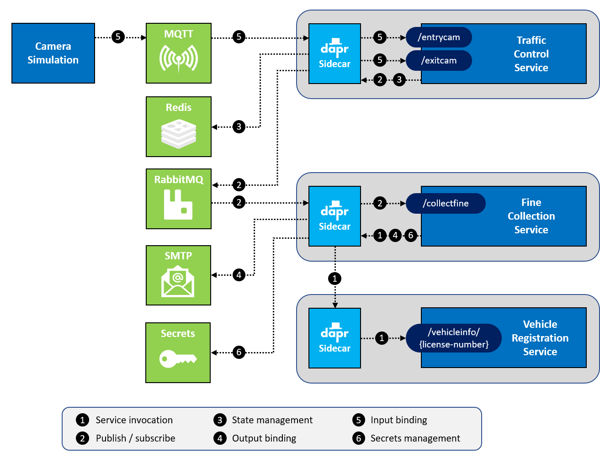
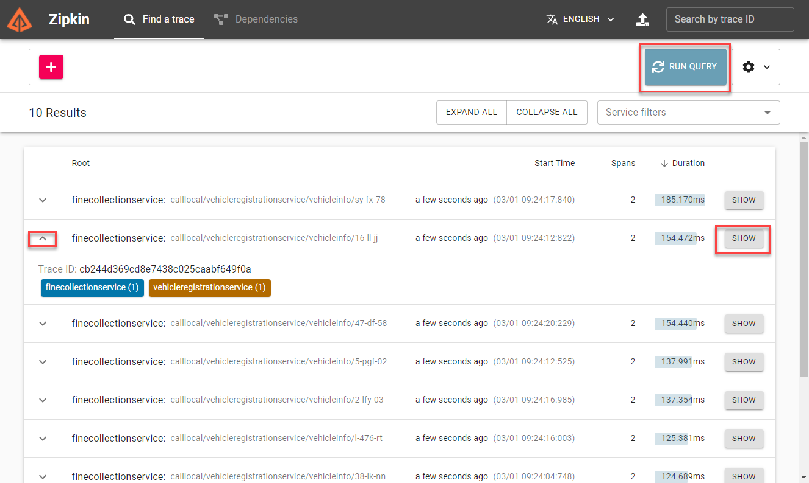
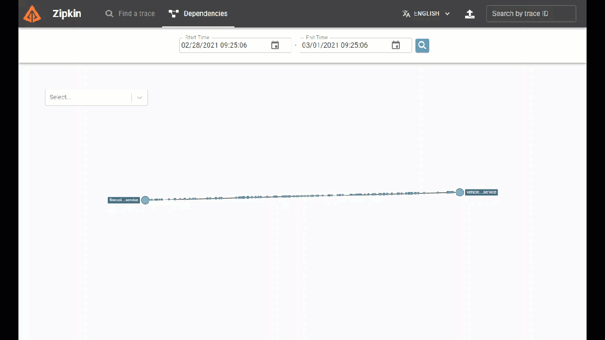

# Assignment 2 - Add Dapr service-to-service invocation

## Assignment goals

To complete this assignment, you must reach the following goals:

- The VehicleRegistrationService and FineCollectionService are both running with a Dapr sidecar.
- The FineCollectionService uses the Dapr service invocation building block to call the `/vehicleinfo/{licensenumber}` endpoint on the VehicleRegistrationService.

This assignment targets number **1** in the end-state setup:



## Step 1: Start the VehicleRegistrationService with Dapr

In assignment 1, you started all the services using `go run ./cmd/main.go`. When you want to run a service with a Dapr sidecar that handles its communication, you need to start it using the Dapr CLI. There are a couple of things you need to specify when starting the service:

- The service needs a unique id which Dapr can use to find it. This is called the *app-id* (or application Id). You specify this with the `--app-id` flag on the command-line.

- Each of the services listens on a different HTTP port for requests (to prevent port collisions on localhost). The VehicleRegistrationService runs on port `6002` for instance. You need to tell Dapr this port so the Dapr sidecar can communicate with the service. You specify this with the `--app-port` flag on the command-line.

- The service can use HTTP or gRPC to communicate with the Dapr sidecar. By default these ports are `3500` and `50001`. But to prevent confusion, you'll use totally different port numbers in the assignments. To prevent port collisions on the local machine when running multiple services, you have to specify a unique HTTP and gRPC port per service. You specify this with the `--dapr-http-port` and `--dapr-grpc-port` flags on the command-line. Throughout the workshop, you will use the following ports:

  | Service                    | Application Port | Dapr sidecar HTTP port | Dapr sidecar gRPC port |
  | -------------------------- | ---------------- | ---------------------- | ---------------------- |
  | TrafficControlService      | 6000             | 3600                   | 60000                  |
  | FineCollectionService      | 6001             | 3601                   | 60001                  |
  | VehicleRegistrationService | 6002             | 3602                   | 60002                  |

- Finally you need to tell Dapr how to start the service. The services are Golang services which can be started with the command `go run ./cmd/main.go`.

You will use the `run` command of the Dapr CLI and specify all the options above on the command-line:

1. Make sure you have started Docker Desktop on your machine and the Dapr CLI and runtime are installed (see the [prerequisites](../README.md#prerequisites)).

2. Open the source code folder in VS Code.

3. Open the terminal window in VS Code and make sure the current folder is `vehicle-registration-service`.

4. Enter the following command to run the VehicleRegistrationService with a Dapr sidecar:

   ```console
   go build ./cmd/main.go
   dapr run --app-id vehicleregistrationservice --app-port 6002 --dapr-http-port 3602 --dapr-grpc-port 60002 ./main
   ```

5. Check the logs for any errors. As you can see, both Dapr as well as application logging is shown as output.

Now you're running a 'Daprized' version of the VehicleRegistrationService. As you might have noticed, you didn't need to change any code for this to work. The VehicleRegistrationService is still just a web API listening for requests. Only now, you've started it with a Dapr sidecar next to it that can communicate with it. This means other services can use Dapr to call this service. This is what you'll do in the next step.

## Step 2: Call the VehicleRegistrationService using Dapr service invocation

In this step, you're going to change the code of the FineCollectionService so it uses Dapr service invocation to call the VehicleRegistrationService.

First you're going to change the code so it calls the Dapr sidecar:

1. Open the file `fine-collection-service/internal/fine_collection/http/handlers.go` in VS Code.

2. Inspect the `CollectFine` method. It contains a call to the VehicleRegistrationService to retrieve the vehicle info:

   ```go
   // get owner info
	vehicleInfo, err := h.vehicleService.GetVehicleInfo(speedingViolation.VehicleId)
   ```

   The `vehicleService` is an instance of a proxy that uses the Golang `net/http` to call the VehicleRegistrationService. You are going to change that proxy so it uses Dapr service invocation.

3. Open the file `fine-collection-service/internal/fine_collection/proxies/vehicle_info_service.go` in VS Code.

4. Inspect the `GetVehicleInfo` method. You can see that in the HTTP call, the URL of the VehicleRegistrationService (running on port 6002) is used.

5. The API for calling the Dapr service invocation building block on a Dapr sidecar is:

   ```http
   http://localhost:<daprPort>/v1.0/invoke/<appId>/method/<method-name>
   ```

   You can substitute the placeholders in this URL with the appropriate values so the FineCollectionService's sidecar can call the the VehicleRegistrationService, this yields the following URL:

   ```http
   http://localhost:3601/v1.0/invoke/vehicleregistrationservice/method/vehicleinfo/{licenseNumber}
   ```

   As you can see in this URL, the FineCollectionService's Dapr sidecar will run on HTTP port `3601`.

6. Replace the URL in the code with the new Dapr service invocation URL. The code should now look like this:

   ```go
   func (p *defaultVehicleInfoService) GetVehicleInfo(licenseNumber string) (models.VehicleInfo, error) {
   	vehicleInfo := models.VehicleInfo{}
   
   	url := fmt.Sprintf("http://localhost:3601/v1.0/invoke/vehicleregistrationservice/method/vehicleinfo/%s", licenseNumber)
     // ...
   }
   ```

   > It's important to really grasp the sidecar pattern used by Dapr. In this case, the FineCollectionService calls the VehicleRegistrationService by **calling its own Dapr sidecar**! The FineCollectionService doesn't need to know anymore where the VehicleRegistrationService lives because its Dapr sidecar will take care of that. It will find it based on the `app-id` specified in the URL and call the target service's sidecar.

7. Open a **new** terminal window in VS Code and make sure the current folder is `FineCollectionService`.

8. Check all your code-changes are correct by building the code:

   ```console
   go build cmd/main.go
   ```

   If you see any warnings or errors, review the previous steps to make sure the code is correct.

9. Enter the following command to run the FineCollectionService with a Dapr sidecar:

   ```console
   dapr run --app-id finecollectionservice --app-port 6001 --dapr-http-port 3601 --dapr-grpc-port 60001 ./main
   ```

10. Check the logs for any errors. As you can see, both Dapr as well as application logging is shown as output.

Now you're going to test the application:

1. Open a **new** terminal window in VS Code and change the current folder to `traffic-control-service`.

2. Enter the following command to run the TrafficControlService:

   ```console
   go build cmd/main.go
   ./main
   ```

> The TrafficControlService does not need to run with a Dapr sidecar in this assignment. This is because it will still call the FineCollectionService over HTTP as before.

The services are up & running. Now you're going to test this using the simulation.

1. Open a **new** terminal window in VS Code and change the current folder to `simulation`.

2. Start the simulation:

   ```console
   go build cmd/main.go
   ./main
   ```

You should see similar logging as before when you ran the application. So all the functionality works the same, but now you use Dapr service invocation to communicate between the FineCollectionService and the VehicleRegistrationService.

## Step 3: Use Dapr service invocation with the Dapr SDK for Golang

In this step, you're going to change the code of the FineCollectionService so it uses the Dapr SDK for Golang to call the VehicleRegistrationService. The SDK provides a more integrated way to invoke the Dapr sidecar API.

First stop the simulation:

1. Open the terminal window in VS Code in which the Camera Simulation runs.

2. Stop the simulation by pressing `Ctrl-C` and close the terminal window by clicking the trashcan icon in its title bar (or typing the `exit` command).

3. Open the terminal window in VS Code in which the FineCollectionService runs.

4. Stop the service by pressing `Ctrl-C`. Keep this terminal window open and focused.

Get Dapr SDK for Go client module:

```go
import "github.com/dapr/go-sdk/client"
```

> The Dapr Go client package contains the `Client` class used to directly invoke the Dapr API as well as additional integrations with Golang. 

Now you'll change the code to use the Dapr SDK `Client` integration to call the VehicleRegistrationService. The `Dapr SDK Client` integration allows you to keep using the regular `InvokeMethod` to make service calls, while the SDK ensures that calls are routed through the Dapr sidecar.

1. Open the file `fine-collection-service/internal/fine_collection/proxies/vehicle_info_service.go` in VS Code.

2. Add a import statement in this file to make sure you can use the Dapr client:

   ```go
   import dapr "github.com/dapr/go-sdk/client"
   ```
3. Open the file `fine-collection-service/internal/fine_collection/vehicle_info_service.go` to define `context` for Dapr Client.

   ```go
   type VehicleInfoService interface {
	  GetVehicleInfo(ctx context.Context, licenseNumber string) (models.VehicleInfo, error)
   }
   ```
4. Open the file `fine-collection-service/internal/fine_collection/proxies/vehicle_info_service.go` to refactoring `GetVehicileInfo` function as well.

   ```go
   func (p *defaultVehicleInfoService) GetVehicleInfo(ctx context.Context, licenseNumber string) (models.VehicleInfo, error) {
	  vehicleInfo := models.VehicleInfo{}

	  daprClient, err := dapr.NewClient()
	  if err != nil {
	    log.Panic(err)
	  }
	  // defer daprClient.Close()

	  methodName := fmt.Sprintf("vehicleinfo/%s", licenseNumber)
	  resp, err := daprClient.InvokeMethod(ctx, "vehicleregistrationservice", methodName, "get")

	  if err != nil {
	    p.logger.Error(err)
		 return vehicleInfo, err
	  }

	  if err := json.Unmarshal(resp, &vehicleInfo); err != nil {
		 p.logger.Error(err)
		 return vehicleInfo, err
	  }

	  return vehicleInfo, nil
   }
   ```

   As you can see in this snippet, you use the `Client` Dapr SDK to create an client connection over GRCP (not HTTP) for doing service invocation. The default port has been specified by `--dapr-grpc-port`.
   You also specify the `app-id` of the service you want to communicate with when you call `InvokeMethod` function and the method name will be `vehicleinfo/{licenseNumber}`

Now the FineCollectionService is changed to use the Dapr SDK for Go service invocation. Let's test this.

1. If you followed the instructions in this assignment, the VehicleRegistrationService and TrafficControlService are still running.

2. Open the terminal window in VS Code in which the FineCollectionService was running.

3. Rebuild FineCollectionService service:

   ```console
   go build cmd/main.go
   ```

4. Enter the following command to start the changed FineCollectionService again:

   ```console
   dapr run --app-id finecollectionservice --app-port 6001 --dapr-http-port 3601 --dapr-grpc-port 60001 ./main
   ```

The services are up & running. Now you're going to test this using the simulation.

1. Open a **new** terminal window in VS Code and change the current folder to `Simulation`.

1. Start the simulation:

   ```console
   ./main
   ```

You should see similar logging as before when you ran the application.

## Step 4: Use Dapr observability

So how can you check whether or not the call to the VehicleRegistrationService is handled by Dapr? Well, Dapr has some observability built in. You can look at Dapr traffic using Zipkin:

1. Open a browser and go the this URL: [http://localhost:9411/zipkin](http://localhost:9411/zipkin).

2. Click the `RUN QUERY` button in the top right of the screen to search for traces.

3. You should see the calls between the FineCollectionService and the VehicleRegistrationService. You can expand and collapse each trace and click the `SHOW` button to get more details:

   

4. If you click the dependencies button and search, you will see the services and the traffic flowing between them:

   

## Next assignment

Make sure you stop all running processes and close all the terminal windows in VS Code before proceeding to the next assignment.

Go to [assignment 3](../Assignment03/README.md).