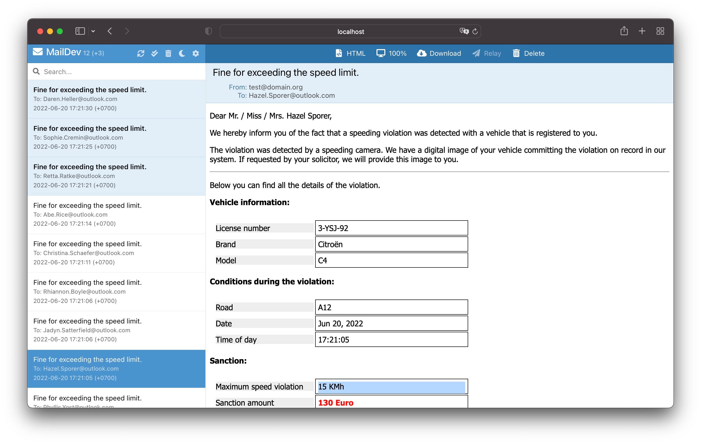

# Assignment 5 - Add a Dapr output binding

## Assignment goals

To complete this assignment, you must reach the following goals:

- The FineCollectionService uses the Dapr SMTP output binding to send an email.
- The SMTP binding calls a development SMTP server that runs as part of the solution in a Docker container.

This assignment targets number **4** in the end-state setup:


## Step 1: Run the SMTP server

In this assignment, you will use [MailDev](https://github.com/maildev/maildev) as your SMTP server. 
This is a development SMTP server that doesn't actually send out emails (by default), 
but collects them and shows them in an inbox type web application it has built-in. 
This is extremely handy in test or demo scenarios.

You will run this server as a Docker container:

1. Open the terminal window in VS Code.

1. Start a MailDev SMTP server by entering the following command:

   ```console
   docker run -d -p 1080:1080 -p 1025:1025 --name dtc-maildev maildev/maildev
   ```

This will pull the docker image `maildev/maildev:1.1.0` from Docker Hub and start it. The name of the container will
be `dtc-maildev`. The server will be listening for connections on port `1025` for SMTP traffic and port `1080` for HTTP
traffic. This last port is where the inbox web app will run for inspecting the emails.

If everything goes well, you should see some output like this:

```console
❯ docker run -d -p 1080:1080 -p 1025:1025 --name dtc-maildev maildev/maildev
Unable to find image 'maildev/maildev:1.1.0' locally
1.1.0: Pulling from maildev/maildev
e6b0cf9c0882: Pull complete
93f9cf0467ca: Pull complete
a564402f98da: Pull complete
b68680f1d28f: Pull complete
d83a90929b44: Pull complete
5bb08f80fc87: Pull complete
021ced319bab: Pull complete
7a42c2dca0ef: Pull complete
Digest: sha256:9ae76db9e72ad3c41a34ffcc327bbd3525849a161d257888f41a8dc4262ec73f
Status: Downloaded newer image for maildev/maildev:1.1.0
b4214ffff2e7624eac3fa3f71bb6b59a1902c9277c9f1dcf5a0742f0807a085f
```

> If you see any errors, make sure you have access to the Internet and are able to download images from Docker Hub.
See [Docker Hub](https://hub.docker.com/) for more info.

The container will keep running in the background. If you want to stop it, enter the following command:

```console
docker stop dtc-maildev
```

You can then start the container later by entering the following command:

```console
docker start dtc-maildev
```

If you are done using the container, you can also remove it by entering the following command:

```console
docker rm dtc-maildev -f
```

Once you have removed it, you need to start it again with the `docker run` command shown at the beginning of this step.

> For your convenience, the `infrastructure` folder contains Powershell scripts for starting the infrastructural
> components you'll use throughout the workshop. You can use the `infrastructure/maildev/start-maildev.sh` script to
> start the MailDev container.
>
> If you don't mind starting all the infrastructural containers at once (also for assignments to come), you can also
> use the `infrastructure/start-all.sh` script.

## Step 2: Use the Dapr output binding in the FineCollectionService

You will add code to the FineCollectionService so it uses the Dapr SMTP output binding to send an email:

1. Open the file `fine-collection-service/internal/fine_collection/email_service.go` in VS Code.

1. Add `SendMail` method to `EmailService` interface

```go
SendMail(speedingViolation models.SpeedingViolation,
   vehicleInfo models.VehicleInfo,
   fine string) error
```

1. Open the file `fine-collection-service/internal/fine_collection/services/default_email_service.go` in VS Code.

1. Add `MessageData` for sending data to Dapr SMTP binding

```go
type MessageMetadata struct {
	Subject   string `json:"subject"`
	EmailTo   string `json:"emailTo"`
	EmailFrom string `json:"emailFrom"`
}
type MessageData struct {
	Data      string          `json:"data"`
	Operation string          `json:"operation"`
	Metadata  MessageMetadata `json:"metadata"`
}
```

1. Add `MailData` struct for binding speed violation data to email template that we will create later on

```go
type MailData struct {
	Now            time.Time
	OwnerName      string
	VehicleId      string
	Brand          string
	Model          string
	RoadId         string
	Timestamp      time.Time
	ViolationInKmh int
	Fine           string
}
```

1. Add `ParseTemplate` method to parse email template in HTML and transfer `MailData` data into it to generate email body

```go
func ParseTemplate(templateFileName string, data interface{}) (string, error) {
	t, err := template.ParseFiles(templateFileName)
	if err != nil {
		return "", fmt.Errorf("ParseTemplate: parse files error: %w", err)
	}

	buf := new(bytes.Buffer)

	if err = t.Execute(buf, data); err != nil {
		return "", fmt.Errorf("ParseTemplate: execute template error: %w", err)
	}

	return buf.String(), nil
}
```

1. Implement `SendMail` to generate email body and send to Dapr SMTP by HTTP post request

```go
func (e defaultEmailService) SendMail(speedingViolation models.SpeedingViolation,
	vehicleInfo models.VehicleInfo,
	fine string) error {

   // generate mail data from speeding violation, vehicle information and fine value
	mailData := MailData{
		Now:            time.Now(),
		OwnerName:      vehicleInfo.OwnerName,
		VehicleId:      vehicleInfo.VehicleId,
		Brand:          vehicleInfo.Brand,
		Model:          vehicleInfo.Model,
		RoadId:         speedingViolation.RoadId,
		Timestamp:      speedingViolation.Timestamp,
		ViolationInKmh: speedingViolation.ViolationInKmh,
		Fine:           fine,
	}

   //generate mail body
	mailBody, err := ParseTemplate("templates/email.html", mailData)

	if err != nil {
		return err
	}

   // create message for sending to Dapr SMTP binding
	messageData := MessageData{
		Data:      mailBody,
		Operation: "create",
		Metadata: MessageMetadata{
			Subject:   "Fine for exceeding the speed limit.",
			EmailTo:   vehicleInfo.OwnerEmail,
			EmailFrom: "test@domain.org",
		},
	}

	messageJson, err := json.Marshal(messageData)
	if err != nil {

		return fmt.Errorf("SendMail encode json error: %v", err)
	}

	resp, err := http.Post("http://localhost:3601/v1.0/bindings/sendmail", "application/json", bytes.NewBuffer(messageJson))

	if err != nil {
		return fmt.Errorf("SendMail create http request Dapr binding sendmail error: %v", err)
	}

	defer resp.Body.Close()

	return nil
}
```

1. You can see the email template in folder `fine-collection-service/templates/email.html` in `assignment5` branch.

1. Open the file `fine-collection-service/internal/fine_collection/http/handlers.go` in VS Code.

1. Inspect the code of the `CollectFine` method. There's a TODO comment at the end of the method. You'll
   add code to complete this TODO and actually send an email.

1. Add the following code to the `CollectFine` method to replace the TODO comment:

   ```go
   // send fine by email
   err = h.emailService.SendMail(speedingViolation, vehicleInfo, fineString)
   if err != nil {
      h.logger.Error(err)
   }
   ```

   First, we create the message data containing the subject, sender, body, and recipient of the message.
   The message data also contains information about the operation that we want to invoke on the binding.
   Finally, we invoke the sendemail binding to send the message to the vehicle owner.

That's it, that's all the code you need to write to send an email over SMTP.  

## Step 3: Configure the output binding

In this step you will add a Dapr binding component configuration file to the custom components folder you created in
Assignment 3.

1. Add a new file in the `dapr/components` folder named `email.yaml`.

1. Open this file in VS Code.

1. Paste this snippet into the file:

   ```yaml
   apiVersion: dapr.io/v1alpha1
   kind: Component
   metadata:
     name: sendmail
   spec:
     type: bindings.smtp
     version: v1
     metadata:
     - name: host
       value: localhost
     - name: port
       value: 1025
     - name: user
       value: "_username"
     - name: password
       value: "_password"
     - name: skipTLSVerify
       value: true
   scopes:
     - finecollectionservice
   ```

As you can see, you specify the binding type SMTP (`bindings.smtp`) and you specify in the `metadata` how to connect to
the SMTP server container you started in step 1 (running on localhost on port `1025`). The other metadata can be
ignored for now.

Important to notice with bindings is the `name` of the binding. This name must be the same as the name used in the call
to the bindings API as you did in the code in step 2:

```go
resp, err := http.Post("http://localhost:3601/v1.0/bindings/sendmail", 
  "application/json", 
  bytes.NewBuffer(messageJson))
```

## Step 4: Test the application

You're going to start all the services now. You specify the custom components folder you've created on the command-line 
using the `--components-path` flag so Dapr will use these config files:

1. Make sure no services from previous tests are running (close the terminal windows).

1. Make sure all the Docker containers introduced in the previous assignments are running (you can use the 
   `infrastructure/start-all.sh` script to start them).

1. Open the terminal window in VS Code and make sure the current folder is `VehicleRegistrationService`.

1. Enter the following command to run the VehicleRegistrationService with a Dapr sidecar:

   ```console
   dapr run --app-id vehicleregistrationservice \
   			  --app-port 6002 \
   			  --dapr-http-port 3602 \
   			  --dapr-grpc-port 60002 \
   			  --components-path ../dapr/components \
   			  go run ./cmd/main.go
   ```

1. Open a **new** terminal window in VS Code and change the current folder to `FineCollectionService`.

1. Enter the following command to run the FineCollectionService with a Dapr sidecar:

   ```console
   dapr run --app-id finecollectionservice \
   			  --app-port 6001 \
   			  --dapr-http-port 3601 \
   			  --dapr-grpc-port 60001 \
   			  --components-path ../dapr/components \
   			  go run ./cmd/main.go
   ```

1. Open a **new** terminal window in VS Code and change the current folder to `TrafficControlService`.

1. Enter the following command to run the TrafficControlService with a Dapr sidecar:

   ```console
   dapr run --app-id trafficcontrolservice \
   			  --app-port 6000 \
   			  --dapr-http-port 3600 \
   			  --dapr-grpc-port 60000 \
   			  --components-path ../dapr/components \
   			  go run ./cmd/main.go
   ```

1. Open a **new** terminal window in VS Code and change the current folder to `Simulation`.

1. Start the simulation:

   ```console
   go run ./cmd/main.go
   ```

You should see the same logs as before. But now you should also be able to see the fine emails being sent by the
FineCollectionService:

1. Open a browser and browse to [http://localhost:1080](http://localhost:1080).
1. Wait for the first emails to come in.
1. Click on an email in the inbox to see its content:
   

## Next assignment

Make sure you stop all running processes and close all the terminal windows in VS Code before proceeding to the next
assignment.

Go to [assignment 6](../Assignment06/README.md).